# 🧩 Ubuntu External Boot Recovery Project

## 🧰 Tech Stack

---

## 📘 Overview
This project documents the process of diagnosing and repairing a dual-boot configuration involving **Windows 11** and **Ubuntu (External SSD)** after bootloader corruption.

The goal was to restore a functional boot environment for both systems and understand how **UEFI**, **GRUB**, and **BCDedit** interact across devices.

---

## ⚙️ System Context

| Component | Details |
|------------|----------|
| **Laptop** | Samsung Notebook (UEFI firmware) |
| **Primary OS** | Windows 11 |
| **Secondary OS** | Ubuntu 22.04 (installed on external Seagate SSD) |
| **Storage** | Seagate Game Drive PS4 (1.8 TB) |
| **Boot Type** | UEFI / GPT |
| **Tools Used** | `bcdedit`, `mountvol`, `efibootmgr`, `fdisk`, `grub-install`, `chroot`, WSL |

---

## 🧠 Objectives
- Restore Ubuntu boot functionality from external SSD  
- Maintain Windows 11 bootloader integrity  
- Investigate and document EFI / GRUB configuration  
- Build a long-term reference for troubleshooting future setups  

---

## 🧩 Key Actions Performed
- Identified partitions using `fdisk -l` and `lsblk`
- Mounted EFI and root partitions manually
- Attempted GRUB reinstall using `grub-install`
- Repaired Windows Boot Manager using `bcdedit`
- Used `efibootmgr` to verify and clean EFI entries
- Created GitHub documentation from within WSL

---

## 📓 Logs & Session Notes
Detailed logs of the process are available here:
- [`notes/2025-10-28-boot-session.md`](notes/2025-10-28-boot-session.md)

---

## 🧰 Next Steps
- [ ] Test external Ubuntu boot using UEFI boot override  
- [ ] Rebuild GRUB configuration if required  
- [ ] Automate detection and repair of EFI entries via script  
- [ ] Add Python-based diagnostic tool (future idea)  

---

## 🧾 Credits
Developed and documented by **Alex Hawkins**  
📅 Project Started: October 2025  
📂 Repository: [github.com/Hawkins30/ubuntu_boot_project](https://github.com/Hawkins30/ubuntu_boot_project)

---
> “Every failed boot teaches you something the BIOS never will.”

---

## 🖥️ System Boot Architecture (Diagram)

```mermaid
graph TD
    subgraph Laptop_Internal["💻 Laptop (Internal Drive)"]
        W11["Windows 11"]
        EFI1["EFI Partition (Windows Boot Manager)"]
    end

    subgraph External_SSD["🧩 External SSD (Seagate Game Drive PS4)"]
        UB["Ubuntu Root (/dev/sda3)"]
        EFI2["EFI Partition (/dev/sda2)"]
    end

    BIOS["UEFI Firmware"]
    BIOS --> EFI1
    BIOS --> EFI2
    EFI1 --> W11
    EFI2 --> UB
```

## 🧾 System Overview

| System | Device | Partition | Mount Point | Description | Status |
|--------|---------|------------|--------------|--------------|---------|
| 💻 **Internal Laptop Drive** | `/dev/nvme0n1` (example) | `EFI` | `/boot/efi` | Windows Boot Manager | ✅ Working |
| 💻 **Internal Laptop Drive** | `/dev/nvme0n1p3` | `NTFS` | `C:\` | Windows 11 OS | ✅ Working |
| 🧩 **External SSD (Seagate Game Drive PS4)** | `/dev/sda2` | `EFI` | `/mnt/boot/efi` | Ubuntu EFI Partition | ⚠️ Repaired |
| 🧩 **External SSD (Seagate Game Drive PS4)** | `/dev/sda3` | `ext4` | `/mnt` | Ubuntu Root | ⚠️ Boot Issues Persist |
| ⚙️ **Firmware / Boot Manager** | `UEFI` | — | BIOS Settings | Boot order and entries (Windows + Ubuntu External) | ⚙️ Under Review |

---

### 🔍 Notes
- EFI entries have been reconfigured multiple times using `bcdedit` and `efibootmgr`.
- Ubuntu’s GRUB install failed with canonical path errors (`/cow`, `/boot/efi`).
- Windows Boot Manager still takes priority (`bootmgr` loads fine).
- Ubuntu boot attempt results in:  
  `File: \EFI\ubuntu\shimx64.efi — Status: 0xc000007b`

---

### 🧠 Next Steps
1. Backup current EFI and BCD configurations.  
2. Attempt GRUB reinstall from chroot with verified `--efi-directory`.  
3. Validate `efibootmgr` boot order consistency in firmware.  
4. Create a clean boot entry if repair fails.

---

### 🧩 References
- [Ubuntu GRUB Manual](https://help.ubuntu.com/community/Grub2)
- [Microsoft BCDedit Documentation](https://docs.microsoft.com/en-us/windows-hardware/drivers/devtest/bcdedit-command-line-options)
- [UEFI Boot Manager Spec](https://uefi.org/specifications)

