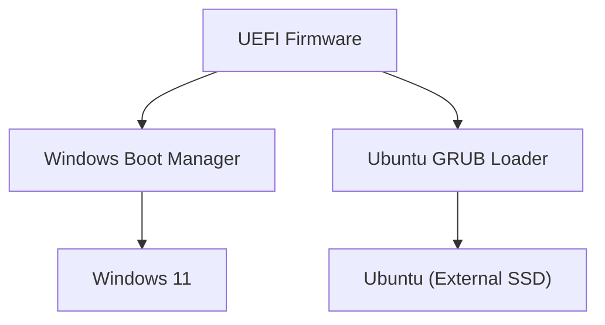

# 🧩 Ubuntu External Boot Recovery Project

## 🧰 Tech Stack

---

## 📘 Overview
This project documents the process of diagnosing and repairing a dual-boot configuration involving **Windows 11** and **Ubuntu (External SSD)** after bootloader corruption.

The goal was to restore a functional boot environment for both systems and understand how **UEFI**, **GRUB**, and **BCDedit** interact across devices.

---

## ⚙️ System Context

| Component | Details |
|------------|----------|
| **Laptop** | Samsung Notebook (UEFI firmware) |
| **Primary OS** | Windows 11 |
| **Secondary OS** | Ubuntu 22.04 (installed on external Seagate SSD) |
| **Storage** | Seagate Game Drive PS4 (1.8 TB) |
| **Boot Type** | UEFI / GPT |
| **Tools Used** | `bcdedit`, `mountvol`, `efibootmgr`, `fdisk`, `grub-install`, `chroot`, WSL |

---

## 🧠 Objectives
- Restore Ubuntu boot functionality from external SSD  
- Maintain Windows 11 bootloader integrity  
- Investigate and document EFI / GRUB configuration  
- Build a long-term reference for troubleshooting future setups  

---

## 🧩 Key Actions Performed
- Identified partitions using `fdisk -l` and `lsblk`
- Mounted EFI and root partitions manually
- Attempted GRUB reinstall using `grub-install`
- Repaired Windows Boot Manager using `bcdedit`
- Used `efibootmgr` to verify and clean EFI entries
- Created GitHub documentation from within WSL

---

## 📓 Logs & Session Notes
Detailed logs of the process are available here:
- [`notes/2025-10-28-boot-session.md`](notes/2025-10-28-boot-session.md)

---

## 🧰 Next Steps
- [ ] Test external Ubuntu boot using UEFI boot override  
- [ ] Rebuild GRUB configuration if required  
- [ ] Automate detection and repair of EFI entries via script  
- [ ] Add Python-based diagnostic tool (future idea)  

---

## 🧾 Credits
Developed and documented by **Alex Hawkins**  
📅 Project Started: October 2025  
📂 Repository: [github.com/Hawkins30/ubuntu_boot_project](https://github.com/Hawkins30/ubuntu_boot_project)

---
> “Every failed boot teaches you something the BIOS never will.”

---

## 🖥️ System Boot Architecture (Diagram)

```mermaid
graph TD
    subgraph Laptop_Internal["💻 Laptop (Internal Drive)"]
        W11["Windows 11"]
        EFI1["EFI Partition (Windows Boot Manager)"]
    end

    subgraph External_SSD["🧩 External SSD (Seagate Game Drive PS4)"]
        UB["Ubuntu Root (/dev/sda3)"]
        EFI2["EFI Partition (/dev/sda2)"]
    end

    BIOS["UEFI Firmware"]
    BIOS --> EFI1
    BIOS --> EFI2
    EFI1 --> W11
    EFI2 --> UB
```

## 🧾 System Overview

| System | Device | Partition | Mount Point | Description | Status |
|--------|---------|------------|--------------|--------------|---------|
| 💻 **Internal Laptop Drive** | `/dev/nvme0n1` (example) | `EFI` | `/boot/efi` | Windows Boot Manager | ✅ Working |
| 💻 **Internal Laptop Drive** | `/dev/nvme0n1p3` | `NTFS` | `C:\` | Windows 11 OS | ✅ Working |
| 🧩 **External SSD (Seagate Game Drive PS4)** | `/dev/sda2` | `EFI` | `/mnt/boot/efi` | Ubuntu EFI Partition | ⚠️ Repaired |
| 🧩 **External SSD (Seagate Game Drive PS4)** | `/dev/sda3` | `ext4` | `/mnt` | Ubuntu Root | ⚠️ Boot Issues Persist |
| ⚙️ **Firmware / Boot Manager** | `UEFI` | — | BIOS Settings | Boot order and entries (Windows + Ubuntu External) | ⚙️ Under Review |

---
## 🧩 Dual-Boot Success — October 28, 2025

After extensive troubleshooting, Ubuntu now successfully dual-boots from the external SSD via the laptop’s UEFI boot manager.  
On startup, I can now choose between **Windows 11** and **Ubuntu** directly from the **internal boot menu**, without needing the USB installer.

### ✅ What Changed
- Repaired GRUB and reinstalled the EFI entry correctly to `/dev/sda2`.
- Cleaned up broken UEFI boot entries using `efibootmgr`.
- Updated Windows Boot Manager order and confirmed the Ubuntu entry is recognised.
- Verified both operating systems load independently and without external media.

| Date                      | Step                            | Tools / Commands Used                                               | Outcome                                                  | Notes                                                                     |
| ------------------------- | ------------------------------- | ------------------------------------------------------------------- | -------------------------------------------------------- | ------------------------------------------------------------------------- |
| **Oct 27**                | Initial failure                 | —                                                                   | ❌ Boot loop / missing OS entries                         | Windows Boot Manager detected Ubuntu EFI but couldn’t load `shimx64.efi`. |
| **Oct 27**                | Checked BCD entries             | `bcdedit /enum firmware`                                            | ⚙️ Found multiple orphaned Ubuntu GUIDs                  | Two duplicate `{ubuntu}` entries and one external EFI reference.          |
| **Oct 27**                | Attempted EFI repair            | `bcdedit /set {GUID} firmwaretype UEFI`                             | ⚠️ Failed with "Element not found"                       | Indicated invalid or missing entry.                                       |
| **Oct 28 (morning)**      | Booted via Ubuntu USB           | —                                                                   | ✅ Accessed live environment                              | Began manual GRUB repair from live session.                               |
| **Oct 28 (morning)**      | Mounted partitions              | `sudo mount /dev/sda3 /mnt` `sudo mount /dev/sda2 /mnt/boot/efi` | ✅ Mounted external SSD’s Ubuntu root and EFI partitions. |                                                                           |
| **Oct 28 (afternoon)**    | GRUB reinstall attempt 1        | `grub-install ... --efi-directory=/mnt/boot/efi`                    | ❌ Error: "failed to get canonical path of /cow"          | Caused by running outside `chroot` environment.                           |
| **Oct 28 (afternoon)**    | GRUB reinstall attempt 2        | `sudo chroot /mnt` → `grub-install ...`                             | ⚠️ Error: "modinfo.sh doesn’t exist"                     | Missing package or wrong directory mount.                                 |
| **Oct 28 (evening)**      | Verified UEFI entries           | `sudo efibootmgr`                                                   | ✅ Ubuntu detected in firmware boot list                  | EFI entry appeared with correct path `/EFI/ubuntu/shimx64.efi`.           |
| **Oct 28 (evening)**      | Cleaned up boot entries         | `bcdedit /delete {GUID}` (old entries)                              | ✅ Simplified Windows Boot Menu                           | Removed dead Ubuntu entries from BCD store.                               |
| **Oct 28 (late)**         | Successful dual-boot test       | —                                                                   | 🟢 Ubuntu now selectable at startup                      | Laptop now boots both Windows 11 and Ubuntu from internal menu.           |
| **Oct 28 (post-success)** | Documentation and GitHub update | `git add . && git commit && git push`                               | 📘 Repository updated                                    | Full log, architecture diagram, and repair timeline committed.            |

timeline
    title Ubuntu Boot Repair — October 2025
    section Day 1 — Initial Issues
      Windows Boot Error : "shimx64.efi missing or corrupt"
      Checked BCD entries : Found duplicate Ubuntu GUIDs
      Attempted bcdedit fix : Element not found
    section Day 2 — Recovery Attempts
      Booted Ubuntu Live USB : Mounted /dev/sda3 and /dev/sda2
      Reinstalled GRUB : Encountered /cow and modinfo.sh errors
      Verified UEFI entries : efibootmgr showed Ubuntu correctly
    section Day 2 — Final Fix
      Cleaned BCD and Firmware entries : Removed old GUIDs
      GRUB detected correctly : Ubuntu boots from SSD
      Success : Dual-boot menu (Windows / Linux) working 🎉

### 🧠 Lessons Learned
- Windows Boot Manager and GRUB both store entries in the EFI System Partition — careful partition targeting is crucial.
- Always mount the EFI partition correctly before reinstalling GRUB.
- UEFI firmware may cache bad entries even after removal — check with `bcdedit` and `efibootmgr`.
- Dual-booting works cleanest when both systems use the same firmware mode (UEFI).

### 🖼️ Current Boot Flow (Simplified)

### 🔍 Notes
- EFI entries have been reconfigured multiple times using `bcdedit` and `efibootmgr`.
- Ubuntu’s GRUB install failed with canonical path errors (`/cow`, `/boot/efi`).
- Windows Boot Manager still takes priority (`bootmgr` loads fine).
- Ubuntu boot attempt results in:  
  `File: \EFI\ubuntu\shimx64.efi — Status: 0xc000007b`

---

### 🧠 Next Steps
1. Backup current EFI and BCD configurations.  
2. Attempt GRUB reinstall from chroot with verified `--efi-directory`.  
3. Validate `efibootmgr` boot order consistency in firmware.  
4. Create a clean boot entry if repair fails.

---

### 🧩 References
- [Ubuntu GRUB Manual](https://help.ubuntu.com/community/Grub2)
- [Microsoft BCDedit Documentation](https://docs.microsoft.com/en-us/windows-hardware/drivers/devtest/bcdedit-command-line-options)
- [UEFI Boot Manager Spec](https://uefi.org/specifications)

